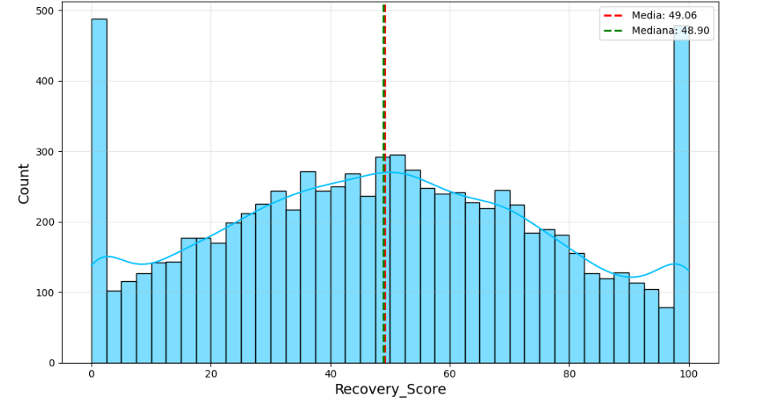
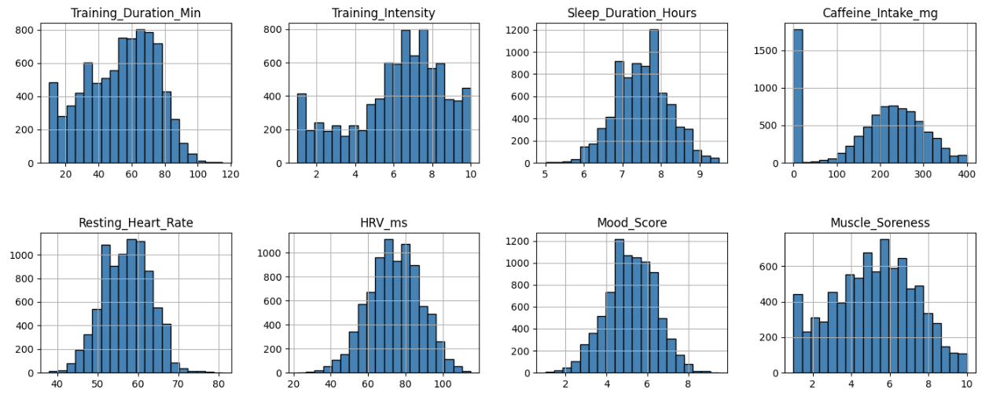
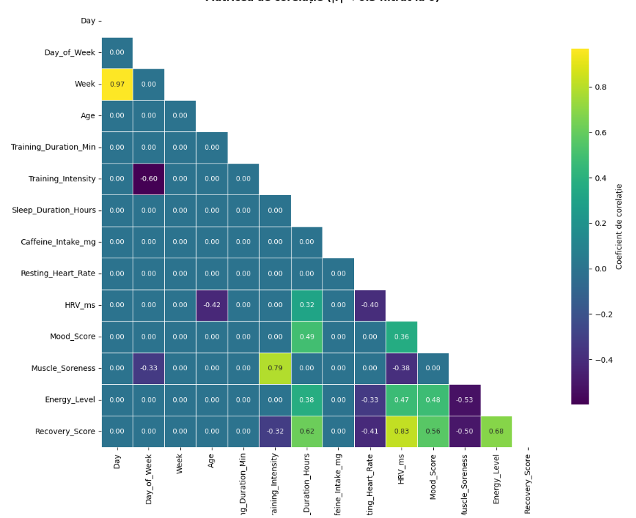
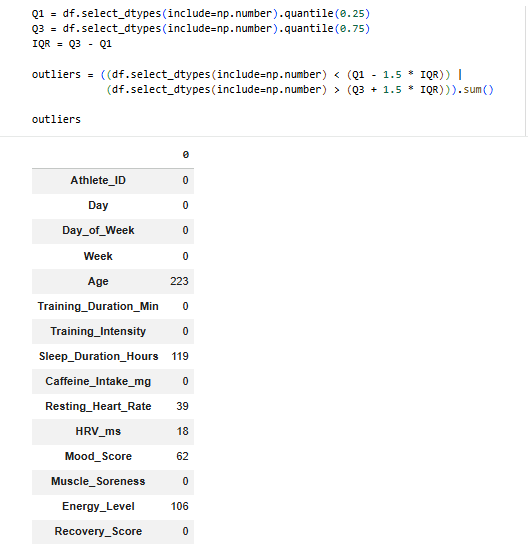
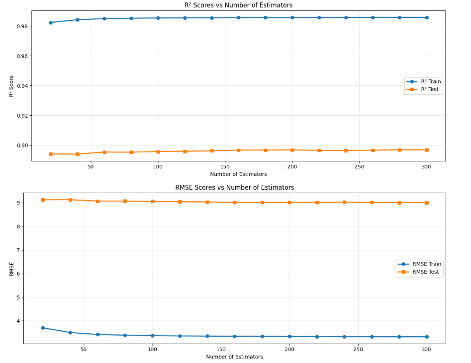
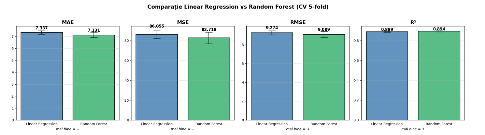
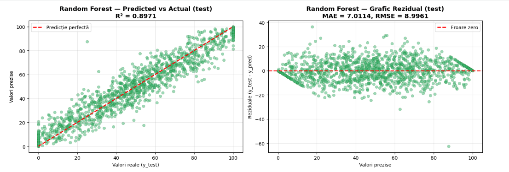

# 🏃 Athlete Recovery Score Prediction

Project for the **Big Data** course — Babeș-Bolyai University, Faculty of Economics and Business Administration, Business Informatics program, Year 3.

**Authors:** Hălăștoan Luca (group 3) · Bozac Andrei (group 1)

> ⚠️ **Important note about the data:** the dataset used is **synthetic** — [*Athlete Recovery & Biometric Performance Dataset*](https://www.kaggle.com/datasets/sarveshchhetri/athlete-recovery-and-biometric-performance-dataset/data) (Kaggle). The records do not come from monitoring real athletes; they were generated algorithmically, most likely through statistical rules that simulate relationships known from sports physiology literature. This has direct implications on the observed model performance (see the [Limitations](#-limitations) section).

---

## 📋 Table of Contents

- [Introduction](#-introduction)
- [Project Objective](#-project-objective)
- [Dataset](#-dataset)
- [Methodology (KDD)](#-methodology-kdd)
- [Exploratory Data Analysis (EDA)](#-exploratory-data-analysis-eda)
- [Data Preprocessing](#-data-preprocessing)
- [Modeling](#-modeling)
- [Final Results](#-final-results)
- [Feature Importance](#-feature-importance)
- [Project Structure](#-project-structure)
- [How to Run the Project](#-how-to-run-the-project)
- [Limitations](#-limitations)
- [Conclusions and Future Directions](#-conclusions-and-future-directions)

---

## 🎯 Introduction

Recovery after intense physical effort is one of the fundamental pillars of modern athletic performance. Athletes exposed daily to high-intensity training face considerable physiological stress, sustained cardiovascular effort, repetitive muscular load, sleep deficits, and psychological stress — all of which affect the body's ability to recover between sessions.

The development of wearable technologies (activity-monitoring bracelets/devices) has made it possible to collect a wide range of biometric indicators in real time: heart rate variability (HRV), sleep duration and quality, resting heart rate, and subjective energy and stress levels. These data create a unique opportunity to apply modern machine learning techniques to predict an athlete's recovery score.

**Practical importance:** an accurate estimate of recovery has direct implications for training decisions — it allows coaches and athletes to adjust session intensity based on current physiological state, preventing overtraining and reducing injury risk. Identifying the variables with the greatest impact on recovery also enables personalization of training and lifestyle.

## 🎯 Project Objective

To develop and evaluate a **numerical prediction model** for an athlete's recovery score (`Recovery_Score`), based on a set of biometric, behavioral, and training variables. The model answers the question:

> *"How well will an athlete recover after training, given their physiological state and the effort level involved?"*

`Recovery_Score` is a continuous numerical variable in the range **0–100**, where higher values represent optimal recovery and lower values represent residual fatigue and increased risk of underperformance.

## 📊 Dataset

- **Source:** [Athlete Recovery & Biometric Performance Dataset](https://www.kaggle.com/datasets/sarveshchhetri/athlete-recovery-and-biometric-performance-dataset/data) — Kaggle (**synthetic data**)
- **Size:** 8,379 records, corresponding to **300 athletes** monitored over **28 consecutive days**
- **Structure:** each record = one training day for one athlete
- **Attributes:** 19 columns in total — 18 potential predictors + 1 target variable (`Recovery_Score`)

### Variable Categories

| Category | Variables |
|---|---|
| **Identification & temporal** | `Athlete_ID` (1000–1299), `Day` (1–28), `Day_of_Week` (1–7), `Week` (1–4) |
| **Demographic** | `Age` (18–41 years), `Gender` (Male/Female), `Sport_Type` (Endurance, Strength, Team Sport, Combat, Mixed) |
| **Training** | `Training_Type` (HIIT, Cardio, Strength, Yoga, Rest), `Training_Duration_Min`, `Training_Intensity` (1–10) |
| **Biometric & behavioral** | `Sleep_Duration_Hours`, `Caffeine_Intake_mg`, `Stress_Level` (Low/Medium/High), `Resting_Heart_Rate`, `HRV_ms`, `Mood_Score` (1–10), `Muscle_Soreness` (1–10), `Energy_Level` (1–10) |
| **Target** | `Recovery_Score` (0–100) |

## 🔬 Methodology (KDD)

The project follows the **KDD (Knowledge Discovery in Databases)** methodology:

```
Data selection → Preprocessing → Model training → Evaluation → Interpretation
```

## 🔎 Exploratory Data Analysis (EDA)

### Target variable distribution

`Recovery_Score` has an approximately normal central distribution, centered around **49**. Two significant accumulations are visible at the scale boundaries (0 and 100), suggesting an **artificial truncation** applied during the synthetic data generation process.



### Numerical variable distributions

- Temporal variables are uniformly distributed (chronologically balanced data)
- `Age` is right-skewed (predominance of younger athletes in the set)
- `Training_Duration_Min` — typical session duration is 60–80 minutes
- `Caffeine_Intake_mg` — bimodal distribution: a major spike at 0 (athletes with no caffeine intake) plus a normal distribution for consumers, centered around 200–250 mg




### Correlation matrix (Pearson)



| Variable | Correlation with `Recovery_Score` | Interpretation |
|---|---:|---|
| `HRV_ms` | **+0.83** | dominant linear predictor |
| `Energy_Level` | +0.68 | strong positive predictor |
| `Sleep_Duration_Hours` | +0.62 | strong positive predictor |
| `Mood_Score` | +0.56 | strong positive predictor |
| `Muscle_Soreness` | −0.50 | moderate negative correlation |
| `Resting_Heart_Rate` | −0.41 | moderate negative correlation |
| `Training_Intensity` | −0.32 | weak-to-moderate negative correlation |

Interesting relationships between predictors: `Training_Intensity` and `Muscle_Soreness` are strongly positively correlated (intense training produces muscle soreness), while `Energy_Level` and `Muscle_Soreness` are negatively correlated (muscle soreness reduces subjective energy).

## 🧹 Data Preprocessing

### 1. Handling missing values


Only 2 columns contain missing values: `Sleep_Duration_Hours` (604 values) and `Training_Intensity` (1 value). Since the missing percentage is small (under 8%) and the affected variables are continuous and approximately normally distributed → **mean imputation** was chosen, preserving the full dataset size (8,379 records).

### 2. Outlier detection (IQR method)




Outliers identified (rule: below Q1 − 1.5·IQR or above Q3 + 1.5·IQR): `Age` (223), `Sleep_Duration_Hours` (119), `Energy_Level` (106), `Mood_Score` (62), `Resting_Heart_Rate` (39). Checking the min/max values via `describe()` confirmed that all values are **physiologically plausible** (e.g., `Age` max = 41 years, `HRV_ms` max = 115ms — elite endurance athletes, `Resting_Heart_Rate` min = 38 bpm — high-performance athletes) → **all outliers were kept**.

### 3. Encoding categorical variables

| Variable | Strategy | Rationale |
|---|---|---|
| `Stress_Level` | Ordinal Encoding (Low=0, Medium=1, High=2) | natural order |
| `Gender` | Label Encoding (0/1) | binary variable, no hierarchy |
| `Sport_Type`, `Training_Type` | One-Hot Encoding | nominal variables with no order |

After encoding, the dataset grew from **19 to 26 columns**.

### 4. Removing `Athlete_ID`

Removed before standardization — it is only an identifier (1000–1299) with no physiological predictive value; keeping it would have allowed non-linear models to "memorize" athlete identity instead of learning the underlying biometric relationships.

### 5. Standardization & train/test split

`StandardScaler` (fit on train only, then applied to test) → split **85% training (7,122 records) / 15% test (1,257 records)**, `random_state=42`. 5-fold cross-validation on the training set was chosen instead of a fixed 70/15/15 split, for a more stable evaluation and more data available for training.

## 🤖 Modeling

A **regression** problem (continuous numerical target). Two algorithms from different methodological paradigms were used:

### Linear Regression (`LinearRegression`, no regularization)

5-fold CV on the training set:

| Metric | Value |
|---|---:|
| MAE | 7.337 |
| MSE | 86.055 |
| RMSE | 9.274 |
| R² | 0.8883 |

The small standard deviations confirm a **stable** model across partitions.

**Coefficients (standardized variables, therefore directly comparable):**

| Feature | Coefficient | Impact |
|---|---:|---|
| `HRV_ms` | +15.52 | dominant predictor |
| `Sleep_Duration_Hours` | +8.01 | second most important predictor |
| `Energy_Level` | +4.18 | positive |
| `Mood_Score` | +1.02 | positive |
| `Stress_Level` | −3.27 | higher stress hinders recovery |
| `Muscle_Soreness` | −3.04 | higher muscle soreness indicates poorer recovery |

### Random Forest

**Baseline** (`n_estimators=100, random_state=42`, 5-fold CV): **R² = 0.8922** — already superior to linear regression, confirming that RF captures non-linear relationships the linear model cannot exploit.

**`n_estimators` curve analysis** (20 → 300, step 20):



Performance stabilizes quickly: Test R² increases from 0.8941 (n=20) to 0.8968 (n=200) — an improvement of only 0.0027 points. Test RMSE drops from 9.13 to 9.00. Saturation occurs around **150–200 trees**; the persistent gap between Train (R²≈0.985) and Test (R²≈0.897) reflects Random Forest's natural tendency to partially memorize the training data.

**Hyperparameter tuning via `GridSearchCV`** (8 combinations × 5 folds = 40 fits):

```python
param_grid = {
    'n_estimators':      [100, 200],
    'max_depth':          [10, None],
    'min_samples_leaf':  [1, 4]
}
```


**Optimal combination:** `n_estimators=200, max_depth=None, min_samples_leaf=4` → R² = 0.8937 (+0.0015 over baseline — a small but methodologically relevant improvement; the default RF was already close to optimal).

### Model comparison (5-fold CV on the training set)





| Metric | Linear Regression | Random Forest (tuned) | RF improvement |
|---|---:|---:|---:|
| MAE | 7.34 | **7.13** | ~2.8% |
| RMSE | 9.27 | **9.09** | ~2.0% |
| R² | 0.8894 | **0.8937** | +0.0043 |

Linear regression has smaller standard deviations on all metrics (e.g., MAE std = 0.15 vs 0.22 for RF) → more stable and directly interpretable, but unable to capture non-linear relationships. Random Forest has superior average performance on all 4 metrics, with the gain coming from capturing non-linear interactions between variables.

**➡️ Final decision:** **Random Forest (tuned)** is the model chosen for the final evaluation on the test set.

## 🏆 Final Results

The final model, trained on the entire training set (7,122 records) and evaluated once on the fully untouched test set (1,257 records):

```python
rf_final = RandomForestRegressor(
    n_estimators=200,
    max_depth=None,
    min_samples_leaf=4,
    random_state=42,
    n_jobs=-1
)
```

| Metric | Test value |
|---|---:|
| **MAE** | **7.01** |
| **RMSE** | **9.00** |
| **R²** | **0.8971** |

Test performance is even slightly better than the CV estimate (test R² 0.8971 vs CV R² 0.8937) — a sign of **absence of overfitting** and solid generalization.



- **Predicted vs Actual:** points cluster tightly around the perfect-prediction line (y=x), visually confirming R² = 0.897. The vertical accumulations at 0 and 100 are a direct consequence of the target truncation identified during EDA.
- **Residual plot:** errors are distributed relatively evenly above and below the zero line, with no systematic patterns → absence of systematic bias.

In practical terms, the model predicts the recovery score with an average error of **~7 points**, explaining **89.7%** of the variation in `Recovery_Score`.

## 🌟 Feature Importance


`HRV_ms` is the dominant predictor, followed by `Sleep_Duration_Hours`, `Stress_Level`, `Energy_Level`, and `Muscle_Soreness` — confirming the observations from the correlation matrix and the linear regression coefficients. Temporal and demographic variables, as well as the one-hot categories, have marginal importance.

## 📁 Project Structure

```
.
├── README.md
├── requirements.txt
├── .gitignore
├── notebook/
│   └── Proiect_Halastoan_Luca_si_Bozac_Andrei.ipynb
├── docs/
│   └── Documentatie_proiect.odt          # full project documentation
├── data/
│   └── recovery.csv                       # dataset (Kaggle, synthetic) — see note below
└── images/
    ├── 01_target_distribution.png
    ├── 02_numeric_distributions.png
    ├── 03_correlation_supplementary.png
    ├── 04_correlation_heatmap.png
    ├── 05_missing_values.png
    ├── 05b_missing_values_table.png
    ├── 06_outliers_analysis.png
    ├── 06b_outliers_table.png
    ├── 07_n_estimators_curve.png
    ├── 08a_gridsearch_table.png
    ├── 08b_comparison_table.png
    ├── 08c_summary_table.png
    ├── 09_lr_vs_rf_comparison.png
    ├── 09b_metrics_table.png
    ├── 10_predicted_vs_actual_residuals.png
    └── 11_feature_importance.png
```

> 📌 For size/licensing reasons, `recovery.csv` is not included directly in the repo — download it from the [dataset's Kaggle page](https://www.kaggle.com/datasets/sarveshchhetri/athlete-recovery-and-biometric-performance-dataset/data) and place it in `data/recovery.csv` before running the notebook.

## ▶️ How to Run the Project

```bash
# 1. Clone the repository
git clone https://github.com/<user>/<repo-name>.git
cd <repo-name>

# 2. Create a virtual environment (optional, recommended)
python -m venv venv
source venv/bin/activate      # Windows: venv\Scripts\activate

# 3. Install dependencies
pip install -r requirements.txt

# 4. Download recovery.csv from Kaggle and place it in data/

# 5. Run the notebook
jupyter notebook notebook/Proiect_Halastoan_Luca_si_Bozac_Andrei.ipynb
```

## ⚠️ Limitations

**The most important point to emphasize: the dataset is synthetic.** The data does not come from monitoring real athletes; it was generated algorithmically. Implications:

- The observed performance (R² ≈ 0.90) is **likely overestimated** — synthetic data is generated through "clean" statistical rules, without the natural noise of real-world measurements
- Real-world confounding factors are missing (injuries, unrecorded individual variation, external conditions, etc.)
- The artificial truncation of `Recovery_Score` at the [0, 100] boundaries affects model behavior at the extremes

## 🚀 Conclusions and Future Directions

The project followed the full KDD pipeline: data selection and description, EDA (histograms, correlation matrix), preprocessing (handling missing values, encoding, standardization), training and comparing two models (linear regression — interpretable; Random Forest — non-linear, ensemble-based) via 5-fold cross-validation, hyperparameter tuning via `GridSearchCV`, and final validation on an independent test set.

**Final model chosen:** Random Forest (`n_estimators=200, max_depth=None, min_samples_leaf=4`) — MAE = 7.01, RMSE = 9.00, R² = 0.8971 on the test set.

Although the synthetic nature of the data limits direct generalization, **the methodology developed is transferable** to real-world applications: personalizing training plans, injury prevention, monitoring amateur athletes. Future directions include:

- Validating the model on real data (wearable devices)
- Integrating additional relevant variables
- Exploring more advanced models (Gradient Boosting, XGBoost, neural networks)
- Developing a practical interface for coaches/athletes

---

*Project developed for the Big Data course — Faculty of Economics and Business Administration, Babeș-Bolyai University.*
